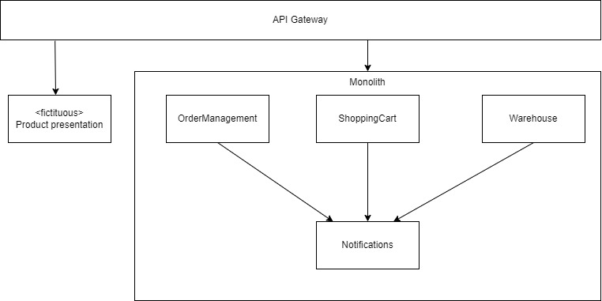
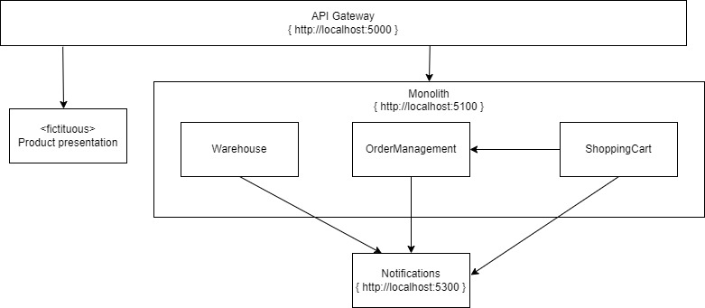

# Pattern: Branch by Abstraction

With this first kata we will extract the notification service. We will move from 
To the following target solution.

You'll notice that the notification functionality is internal to the monolith, only used by the components _OrderManagement_, _ShoppingCart_ and _Warehouse_

We will need a strategy to move the notifications logic into it's own service, and then route the calls from the internal components to this new service.

An useful pattern for this is Branch by Abstraction.

Branch by abstraction has 4 distinct phases.
1. Create an abstraction for the logic you want to extract
1. Change the cliënts of the exsting functionality to use the new abstraction
1. Create a new implementation replacing the old functionality
1. Switch the abstraction to use the new implementation
1. Remove the old implementation and possibly remove the abstraction

## Exercise: extract Notification service 

Step 1: Create an abstraction

Find the boundary of the notification service. Create an abstraction for this boundary. Define the methods in this abstraction which will service the functionality.

Step 2: Change the cliënts of the existing functionality

Step 3: Create a new implementation

Step 3.1: Duplicate the notification logic into the notifications service and make sure the endpoints are working

Step 3.2: Create a new implementation which will call the proper endpoints

Step 4: Switch the abstraction to use the new implementation

If you want to be bold, use a feature toggle to darklaunch the new notification service. You might want to route traffic of al customernumers ending with '1'. This way you can test the load. In an enterprise setting you might decide to 'parallel run' the new service by calling both the old and new functionality and validate the output of each functionality. This is a form of production testing which might help you validate the logic and give control on when to go live.

Step 5: Clean up the old code

Remove the old logic from the monolith. Finish with removing the abstraction.