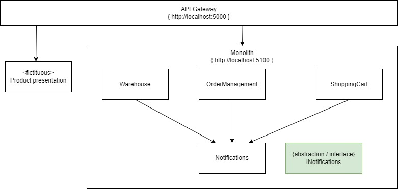
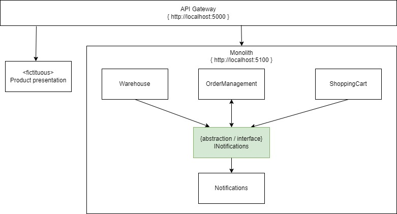
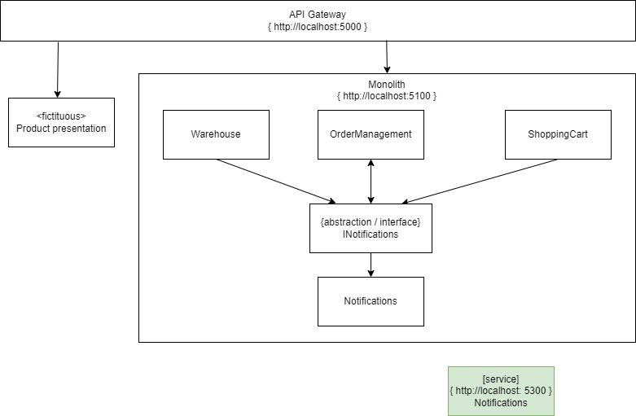
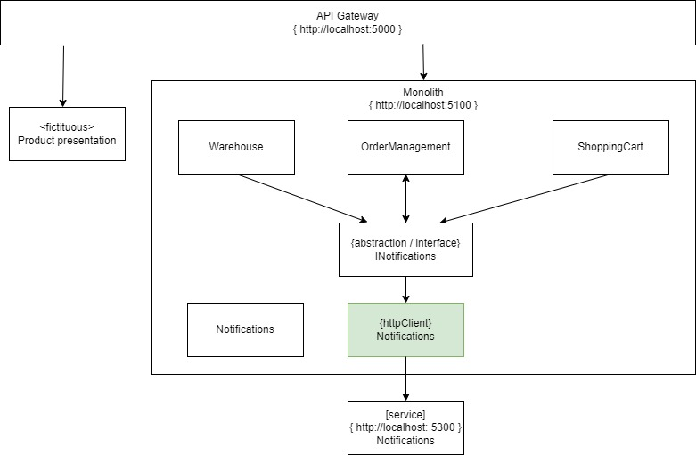
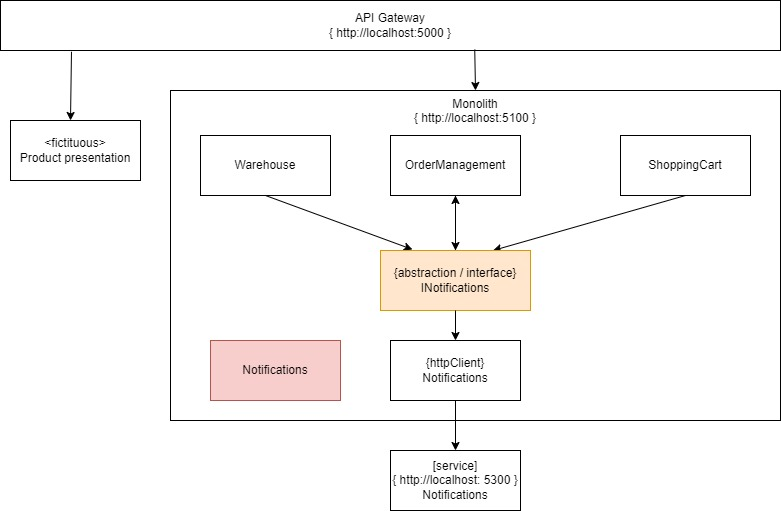

# Pattern: Branch by Abstraction

With this first kata we will extract the notification service. We will move from 
To the following target solution.

You'll notice that the notification functionality is internal to the monolith, only used by the components _OrderManagement_, _ShoppingCart_ and _Warehouse_

We will need a strategy to move the notifications logic into it's own service, and then route the calls from the internal components to this new service.

An useful pattern for this is Branch by Abstraction.

Branch by abstraction has 4 distinct phases.
1. Create an abstraction for the logic you want to extract
1. Change the cliënts of the exsting functionality to use the new abstraction
1. Create a new implementation replacing the old functionality
1. Switch the abstraction to use the new implementation
1. Remove the old implementation and possibly remove the abstraction

The following visuals and descriptions will guide you through the steps.

## Exercise: extract Notification service 

### Step 1: Create an abstraction

Find a logical 'seam', between the components in the solution where you can  define a contract of sorts to use the functionality of the notifications component. If you can't find a 'seam' then create a contract for the notifications component yourself. Then create an abstraction (interface) for that contract.

### Step 2: Change the cliënts of the existing functionality

The next step is to change the cliënts using the notifications logic. They should be using the abstraction instead of the component directly.

### Step 3: Create a new implementation
Now it's time to create the notifications service. There are multiple angles to do this in enterprise situations. Depending on the situation you should decide what to do. Some ideas are:
* Copy the entire monolithic codebase into a new service, get it running asap and remove all unnecesarry code.
* When the monolith is cleanly seperated into functional modules then you can copy the module logic itself
* You can completely rewrite the service.

For this kata you could probably best go for copying the module logic from the monolith to the new service, and add an endpoint to it.

### Step 4: Switch the abstraction to use the new implementation
The next step is actually using the new service. To do this you'll need to create an implementation on the abstraction you created in step 1. This new implementation routes the call to the newly created notifications service.

### Step 5: Clean up the old code

Remove the old logic from the monolith. Finish with removing the abstraction if you don't plan to use it anymore.

