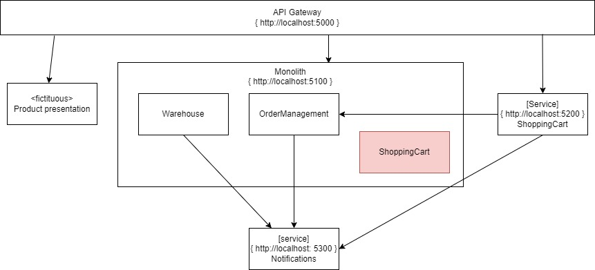

# Pattern: Strangler Fig

We used _Branch by abstraction_ to extract a piece of internal logic from the monolith into a service of it's own.

_Strangler fig_ is a pattern you might use when you want to extract a bounded context / aggregate / piece of logic on the boundary of your system. It boils down to extracting logic from your monolith for which you aren't able or don't want to route traffic from the monolith code to the new functionality.

For this kata we'll move from the following starting architecture:

To:

This pattern boils down to the following steps.

1. Identify the module you want to extract
1. Create a microservice which facilitates the functionality you want to extract
1. Route the traffic to new microservice
1. Remove unused code from the monolith

## Exercise: extract Shopping Cart / Basket service 

### Step 1 identify the module you want to extract
This step is already done. We'll extract the ShoppingCart bounded context from the monolith.
In your enterprise situation there might be various reasons you decide on extracting funtionality. There should always be a business driver for extracting a service.

### Step 2 create the shoppingcart microservice
The code with this kata already contains a skeleton shoppingcart service. You need to add the logic and the endpoints. It's up to you how you do this. The same options are available to you as in _Branch by Abstraction_

You might notice that the checkout functionality in the shoppingcart bounded context also creates an order. For this kata you'll need to move the checkout functionality to the shopping cart service as well. This will result in an extra connection from the shoppingcart service to the monolith, creating the Order.
In an enterprise setup this would be an ideal coupling point to migrate to a messaging setup once you created the new microservice. For this kata we'll stick with http.

### Step 3 Route traffic to the new microservice

Depending on what the situation is, you can route traffic through various ways.
* use a proxy and route traffic to the new service based on content
* when using API Management you could program it to use the new service
* If you are using a API Gateway or BFF solution then reprogram this component to use the new service

For this kata we will use the API Gateway which is part of the solution. The postman collection which is part of the repository is configured to call the monolith.
You can change the code in the API gateway, or if you made sure the contract on the endpoint of the new shoppingcart service is exactly the same as the endpoint of the shopping cart in the monolith, then you can change the header field _forceNewService_ to true. This forces the API Gateway to communicate with the new shoppingcart service.

### Step 4 remove the unused code from the monolith

Remove the shoppingcart bounded context from the monolith. This code is no longer actively used at this time.
