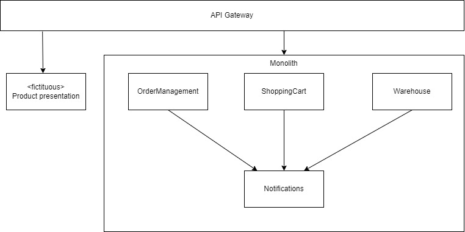

# Kata

Since the shop has gone online, the traffic has been climbing. More and more citizens of stormwind city find our online service. This growth started since we went online a couple of years ago.
Our systems are showing the first signs of stress, and sometimes we can't even help all potential customers because our system can't proces the requests in time. This is causing a negative effect on our conversion rate.

We want to keep growing our business and want more customers to click on that buy button. To be able to do this, we should be able to service more customers during peak hours and increase stability or our system as a whole.
Our current solution is scaling vertically. We also scale horizontally if necessary, but we won't be using the resources effectively.

We already extracted product presentation, this service is handling the most traffic. The next service which is handling loads of traffic is our shoppingcart service. So we would like you to extract this service for us.

Before you start extracting the basket service, you need to extract the notification service. The reason for this is that notifications are sent from alot of our services, basket and warehouse are some of them. As you can see in the following diagram

We want to prevent circular dependencies if possible, besides that, and probably more important, we would like to start developing new functionality with our notifications as soon as possible. Think of advertising, special communications for attracting more customers and more.

## Steps
1. Start with the [Branch by abstraction](./BranchByAbstraction.md) kata, this kata will help you with extracting the notification service
1. Once you are done with [Branch by abstraction](./BranchByAbstraction.md), hop on over to the [Strangler fig](./StranglerFig.md) kata, this kata will extract the shopping cart logic into it's own microservice

## Guidelines and notes
You can make it easy on yourself and create one big bang commit, move large swaths of code around. However, your won't be able to this in an enterprise situation. Often you are in a situation that you need to do these steps and refactorings while also adding functional features adding 'direct' business value.
Try convincing your product owner the value of having a large pull request moving the logic around, make it all work. The result will probably be that you have a branch which needs to be continuously updated with new features and code, committed to main.

So, to learn the most from these kata's, force yourself to create tiny commits. The solution isn't setup with TDD in mind, so testing will be done by checking a running instance.
We will facilitate you with a running instance in Azure and some monitoring, so any commit you do will immediatly trigger a build and deploy it for you.