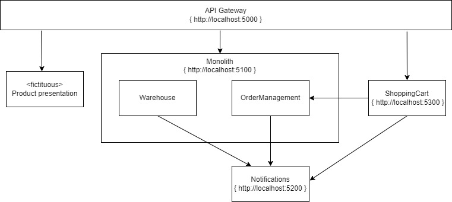

# Monolith2MicroservicesKata

## Purpose
Purpose of this kata is to extract microservices from the Monolith. 

## situation
Gilded rose has it's webshop online, so people all over Stormwind city can order from their homes. Due to the high demands the current system is becoming unstable. Scaling the current monolith no longer is a viable option.

At first we extracted Product presentation which takes the highest loads, customers browsing through our collection. This gave us some breathing space so we could scale further. However, the next bottleneck is starting to show, which are the shoppingcart and the warehouse.
We decided to extract the Shoppingcart functionality first. We expect that this extraction will reduce load on the monolith as a whole and because of that, the remaining logic will also improve performance and stability.

As an extra, once we have the basket extracted, we can start adding features to attract more customers without destabilizing our service. Stuff like coupons and discounts.

## Architecture
The kata starts with a running instance of the Monolith.

The architecture of the monolith

## Solution
The solution is arranged in folders:
* ApiGateway
* Monolith
* Services/Notifications
* Services/ShoppingCart

While working on the code, make sure you don't add project references crossing these folders/namespaces. They are meant to be completely seperated.

## explanation
The purpose of this kata is to exercise extracting services from a monolithic system.

## Target model
The target model for this kata is the following architecture.

Containing the following services:

_API Gateway_

uri: http://localhost:5000

Routes traffic to the right service. Initially all traffic will be routed to the monolith. This will change the moment you progress to the 'Strangler fig' pattern.

_Monolith_

uri: http://localhost:5100

The monolith code. Fucntionally not representative of a real world situation. However it's setup is modular, and each module is n-layered. Each module represents a bounded context. Bounded contexts and aggregates (DDD) is ideal in granularity for microservices, which result in high cohesion and low coupling.

An ideal situation to practice the patterns.

_Notifications_

uri: http://localhost:5200

This service is meant to contain the Notifications bounded context. 
Initially it has some basic 'plumbing' so that you won't be bothered with this. This way you can focus on the patterns for migrating to a microservice.

_ShoppingCart_

uri: http://localhost:5300

This service is meant to contain the ShoppingCart bounded context. 
Initially it has some basic 'plumbing' so that you won't be bothered with this. This way you can focus on the patterns for migrating to a microservice.

## Functionality
The API Gateway will be your entry point during the entire kata, initially this gateway will route traffic to the monolith. So make sure all services are running locally when testing.

The [postman collection](./Microservices2MonolithKata.postman_collection.json) in this repository is configured with all initial endpoints present in the API Gateway.

The API gateway has the following endpoints:

_Warehouse_

---
Verb GET: /warehouse 

This endpoint returns all stock present in the warehouse.

Verb: POST: /warehouse/receive-goods

With receive-goods you can add stock to the warehouse

_ShoppingCart_

---
Verb GET: /basket/{customerNumber}

This endpoint returns the current shoppingbasket of the given customer. Any {customerNumber} will suffice, the solution doesn't check whether or not the customer exists or not.

Verb POST: /basket/{customerNumber}?productCode={productCode}

With this endpoint you add a product defined with {productCode} to the basket of the given customernumber.
The following {productCode} values are accepted:
* NORM-MoonJ      ==> Moonberry Juice
* EPIC-Ragnaros   ==> Sulfuras, Hand of Ragnaros
* TICK-TAFK       ==> Backstage passes to a TAFKAL80ETC concert
* SPOIL-BRIE      ==> Spoiled Brie

Verb Post: /basket/{customerNumber}/checkout

This endpoint will checkout the shoppingcart, meaning that the given customer will pay for the selected goods, and order will be created and the customer will be notified (indicated by adding a record to the database)

_Simulation_

These endpoints are marked for improvement.

The simulation endpoints can be used to help you populate the database and simulate the daily operations of a warehouse. These endpoints should be moved to a seperate solution or atleast out of the monolith, as they are currently make the kata a bit harder to do (you'll notice it soon enough).

Currently the following endpoints are present:

Verb PATCH: /simulation/resetsimulation

Clears the database of any record. 

Verb PATCH: /simulation/dayhaspassed

Ticks the warehouse that a day has passed, effectively kicking of the [original](https://github.com/NotMyself/GildedRose) gildedrose kata logic found in the warehouse bounded context.

Verb PATCH: /simulation/updatehourlywork

Processes outstanding orders, updating the stocklevels in the warehouse and informs the customers that their order is processed and internal operations of the warehouse that stock is updated.

## Patterns to use in this Kata
The following patterns are part of this Monolith to Microservices Kata, click on the links to navigate to the kata's themselves. Advise is to follow the order of the list below
1. [Branch by abstraction](./Katas/BranchByAbstraction.md)
1. [Strangler Fig](./Katas/StranglerFig.md)
1. Content-based-router (pending)
1. Parallel run (pending)

## References

Monolith to Microservices

## Credits 

This kata is inspired by Terry Hughes gilded rose kata which can be found at https://github.com/NotMyself/GildedRose

Check out the repository of Emily Bache
Check out the repository of Emily Bache if you would like to work on this specific kata in another language. Which can be found at https://github.com/emilybache/GildedRose-Refactoring-Kata